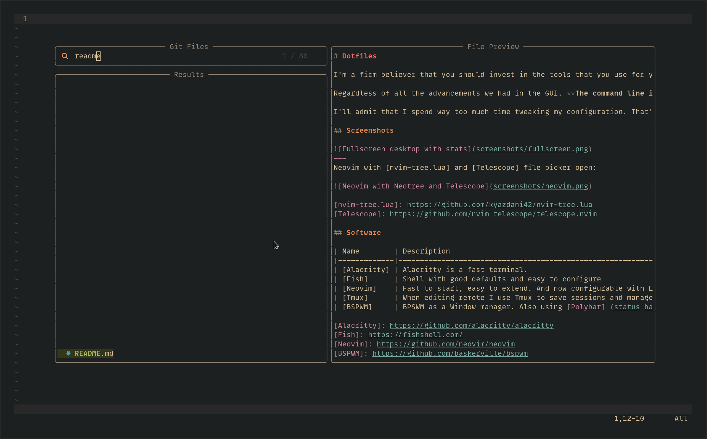

# Dotfiles

I'm a firm believer that you should invest in the tools that you use for your profession. Both hardware, having a good ergonomic setup and software, mastering and tweaking the tools you use daily.

Regardless of all the advancements we had in the GUI. **The command line is still the best developer experience.**

I'll admit that I spend way too much time tweaking my configuration. That's why this repository is here, so you don't have to. Enjoy!

## Screenshots

---
Neovim with [nvim-tree.lua] and [Telescope] file picker open:

[nvim-tree.lua]: https://github.com/kyazdani42/nvim-tree.lua 
[Telescope]: https://github.com/nvim-telescope/telescope.nvim

## Software

| Name        | Description                                                                           |
|-------------|---------------------------------------------------------------------------------------|
| [Alacritty] | Alacritty is a fast terminal.                                                         |
| [Fish]      | Shell with good defaults and easy to configure                                        |
| [Neovim]    | Fast to start, easy to extend. And now configurable with Lua. Must use version 0.5.0+ |
| [Tmux]      | When editing remote I use Tmux to save sessions and manage my windows                 |
| [BSPWM]     | BPSWM as a Window manager. Also using [Polybar] (status bar) and [Rofi] (launcher)    |

[Alacritty]: https://github.com/alacritty/alacritty
[Fish]: https://fishshell.com/
[Neovim]: https://github.com/neovim/neovim
[BSPWM]: https://github.com/baskerville/bspwm
[Tmux]: https://github.com/tmux/tmux
[Polybar]: https://github.com/polybar/polybar
[Rofi]: https://github.com/davatorium/rofi

## Usage

Clone the repository under a more descriptive name: `git clone https://github.com/wunki/wunki-dotfiles.git wunki-dotfiles`.

The dotfiles directory contains a `Makefile` which will symlink files into the right place. Proceed with caution though, it will override your own configuration. To give an example, you can run `make neovim` to configure Neovim.

## Commandline tools

I also make use of some convenient command line tools which enrich the default command line tools coming with Unix.

| Name  | Description                                            |
|-------|--------------------------------------------------------|
| [bat] | cat clone with syntax highlighting and Git integration |
| [fd]  | find replacement with better usability                 |
| [exa] | ls replacement with git integration                    |
| [fzf] | command line fuzzy finder                              |
| [btm] | top replacement with pretty graphics                   |

[bat]: https://github.com/sharkdp/bat
[fd]: https://github.com/sharkdp/fd
[exa]: https://github.com/ogham/exa
[fzf]: https://github.com/junegunn/fzf
[btm]: https://github.com/ClementTsang/bottom

## Credits

The Neovim configuration is mostly a copy from [NvChad], with some of my own adjustments.

[NvChad]: https://github.com/siduck76/NvChad

